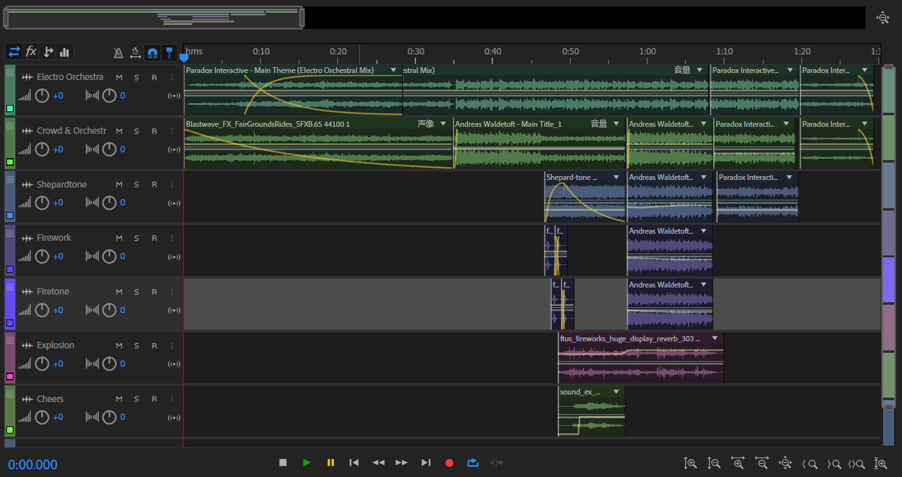

### Source music and Modification

The source music is the game *Crusade Kings*'s main theme, which itself is of medieval style.

I mixed two versions (original and electro orchestra) of it together. The Shepard-tone at around 50'' represents the firework going up, and introduces the orchestra part with firework explosion sound as background. To make a smooth transition to the end, an echo is created by a stack of music, each delayed by several milliseconds.

A screenshot of my modification is shown below:

